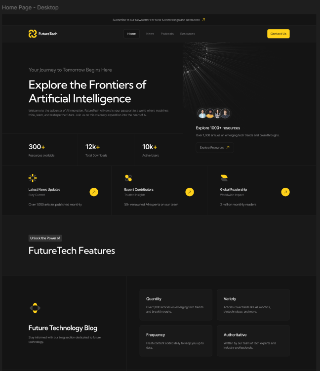

# Большой многостраничный сайт

Этот проект — огромный многостраничный, сверстанный по макету из Figma.  
Сайт корректно отображается на различных устройствах.
Использовался **HTML/SCSS/JS**

---

## Демо проекта

Демо доступно по ссылке: **[Перейти к демо](https://jacio1.github.io/landings-and-multipages/future-tech)**

---

## Макет в Figma

Ссылка на макет: **[Открыть макет в Figma](https://www.figma.com/design/vbixOAH75YnYC8nv67TPvY/FutureTech--Copy-?node-id=18-214&p=f&t=ZbNC0NlOfm39Okou-0)**

---

## Превью

